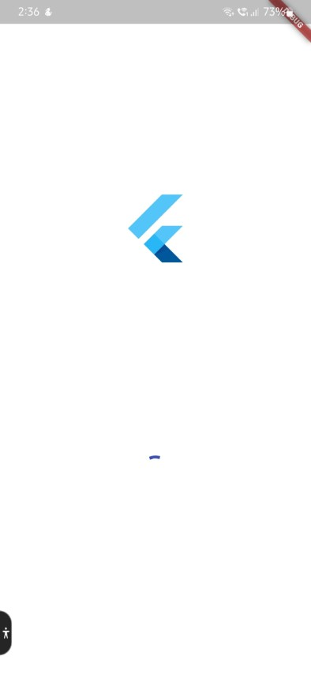
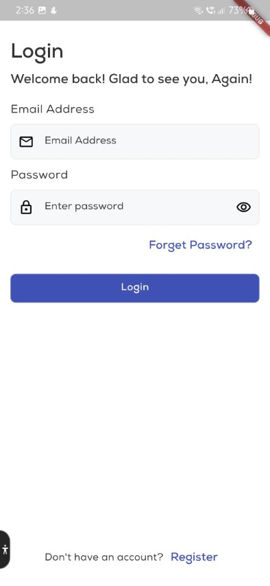
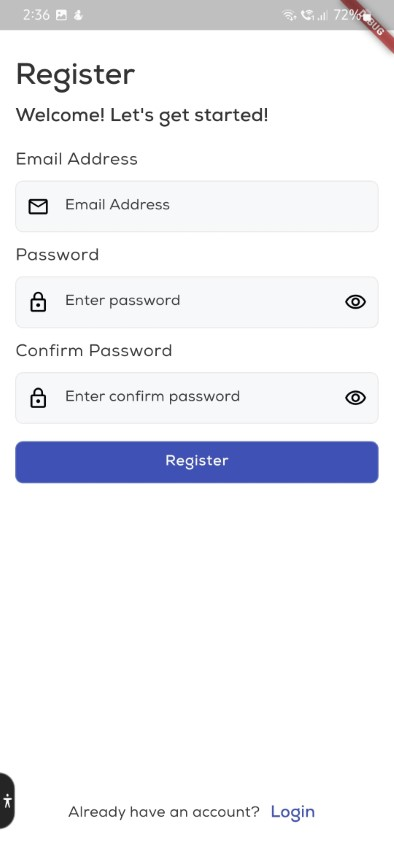
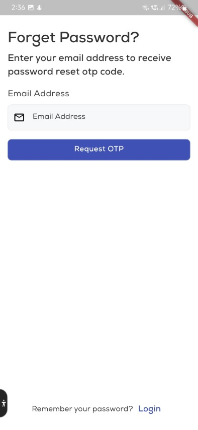
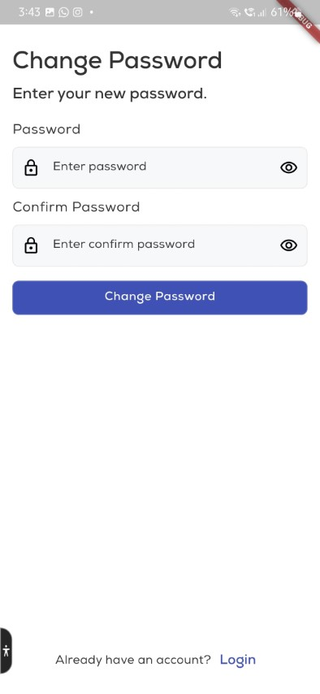
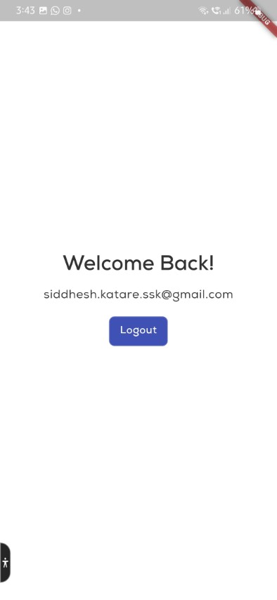

# 🚀 Flutter GetX CLI Quick Start Base App

A robust and scalable Flutter starter template built using [GetX CLI](https://pub.dev/packages/get_cli), designed for rapid development and deployment of mobile applications. This boilerplate comes pre-equipped with essential screens, modular architecture, and controller-based validation, enabling teams and individuals to launch Flutter projects efficiently.

---

## 🧩 Key Features

This base project includes foundational screens for user authentication and routing, providing a seamless head start for most Flutter apps:

### 📱 Pre-Built Screens

- **Splash Screen**  
  The initial screen loaded while the app is preparing resources.

- **Login Screen**  
  Includes:
  - Email Address Text Field  
  - Password Text Field  
  - "Forget Password?" Text Button  
  - Login Button  
  - "Register" Navigation Text Button  

- **Register Screen**  
  Includes:
  - Email Address Text Field  
  - Password Text Field  
  - Confirm Password Text Field  
  - Register Button  
  - "Login" Navigation Text Button  

- **Forget Password Screen**  
  Includes:
  - Email Address Text Field  
  - Request OTP Button  

- **Change Password Screen**  
  Appears after OTP verification. Includes:
  - New Password Text Field  
  - Confirm New Password Text Field  
  - Change Password Button
  
- **Home Screen**  
  Appears after login and register. Includes:
  - Welcome Message  
  - User email address  
  - Logout Button


> ✅ All forms feature controller-level validation to ensure proper data entry and user feedback on submit.

---

## 🛠️ Tech Stack

| Technology | Usage |
|------------|-------|
| **Flutter** | Mobile UI Framework |
| **GetX** | State Management, Navigation, Dependency Injection |
| **Get CLI** | File Structure & Code Generation |
| **flutter_gen** | Type-safe Asset Management |

---

## 🧱 Project Structure (Generated via Get CLI)

```
lib/
├── app/
│   ├── constants/
│   │   ├── app_constants.dart
│   │   ├── color_constants.dart
│   │   ├── string_constants.dart
│   │   ├── theme_data.dart
│   ├── theme/
│   │   ├── theme_data.dart
│   ├── modules/
│   │   ├── splash/
│   │   │   ├── bindings/
│   │   │   ├── controllers/
│   │   │   └── views/
│   │   ├── login/
│   │   ├── register/
│   │   └── forget_password/
│   │   └── change_password/
│   └── routes/
│       ├── app_pages.dart
│       └── app_routes.dart
│   └── services/
│       ├── notification_service.dart
│   └── utils/
│       ├── auth_utils.dart
│       └── extensions.dart
│       └── log_utils.dart
│       └── snackbar_utils.dart
│   └── widgets/
│       ├── custom_icon_button.dart
│       └── custom_text_form_field.dart
│   └── gen/ (auto-generated by flutter_gen)
│       ├── assets.gen.dart
│       └── fonts.gen.dart
├── main.dart
```

> The structure follows GetX’s modular pattern to ensure maximum scalability and separation of concerns.

---

## 🧰 Installation & Setup

### ⚙️ Prerequisites

Ensure you have the following installed:

- Flutter SDK (Latest Stable)
- Dart
- Get CLI  
  Install via:
  ```bash
  dart pub global activate get_cli
  ```

- Flutter Gen  
  Add to `pubspec.yaml` and run:
  ```bash
  flutter pub run build_runner build --delete-conflicting-outputs
  ```

---

### 🏗️ Getting Started

1. **Clone the repository:**

   ```bash
   git clone https://github.com/your-username/flutter_getx_base_app.git
   cd flutter_getx_base_app
   ```

2. **Install project dependencies:**

   ```bash
   flutter pub get
   ```

3. **Generate type-safe assets using flutter_gen:**

   This will auto-generate the `Assets` class for managing images and other resources:

   ```bash
   flutter pub run build_runner build --delete-conflicting-outputs
   ```

4. **Run the app:**

   Launch the app on your preferred device or emulator:

   ```bash
   flutter run
   ```

---

## ✨ Screenshots

### 🚀 Splash Screen


### 🔐 Login Screen


### 📝 Register Screen


### 🔓 Forgot Password Screen


### 🔓 Verify OTP Screen


### 🔓 Change Password Screen


### 🔓 Home Screen



---

## 🧪 Validation Details

All form-related logic and validations are handled inside their respective `Controller` classes using GetX's `TextEditingController` and validation patterns. Error messages are returned directly to the UI for a reactive form experience.

---

## 🤝 Contributing

We welcome contributions and feature enhancements. Fork the repository, make your changes, and submit a pull request.

> Please adhere to the code style and project architecture to maintain uniformity.

---

## 📜 License

This project is licensed under the MIT License.  
Feel free to use it for commercial or non-commercial purposes.

---

## 🙌 Acknowledgments

This project leverages a modern Flutter development toolchain. Special thanks to the maintainers of the following open-source packages:

- [Flutter](https://flutter.dev) – for the powerful and flexible cross-platform SDK  
- [GetX](https://pub.dev/packages/get) – for efficient state management, dependency injection, and route management  
- [Get CLI](https://pub.dev/packages/get_cli) – for automating scalable project architecture and module generation  
- [flutter_gen](https://pub.dev/packages/flutter_gen) – for type-safe, code-generated asset management

---

> Made with ❤️ by Siddhesh Katare – Flutter Developer & Architect
